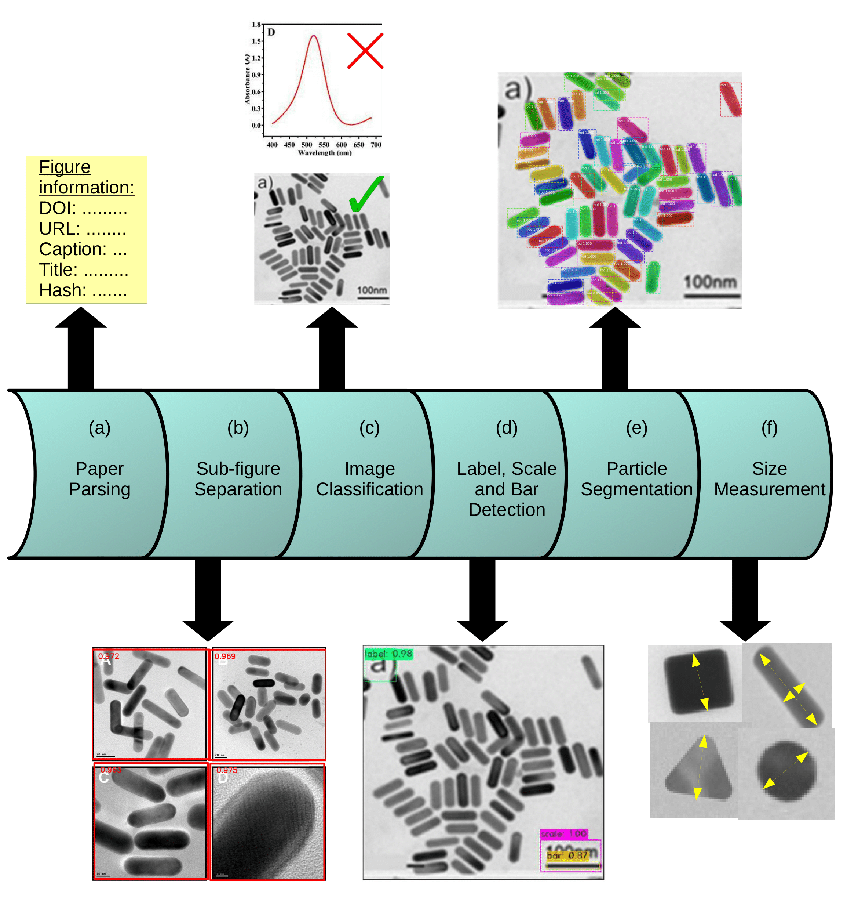

# Setup Instructions

## Model Weights
1) Download [SEM TEM Other Classifier weights](https://drive.google.com/file/d/1WcFTsYAxBUp5jic2rsLEHb6fW7Pw9PEn/view?usp=sharing) and place it in `classifier/SEM_TEM_Other_weights`.
3) Download [Particulate Non-Particulate Classifier weights](https://drive.google.com/file/d/1buy3jZ_sVOo9absjWqk8MYwhjFk6JNJC/view?usp=sharing) and place it in `classifier/Particulate_nonParticulate_weights`.
3) Download [Figure separation weights](https://drive.google.com/file/d/18moIauxgQR2-b4XRF7MAzseyq_8WGJ9D/view?usp=sharing) and place it in `figure-separator/data`.
4) Download [SRCNN weights](https://drive.google.com/file/d/1zmBxzC9SVJm9vciOPLbKzVIVlH09UZtW/view?usp=sharing) and place it in `label_scale_bar_detector/OCR/SRCNN-pytorch/weights/`.
5) Download [Darknet weights](https://drive.google.com/file/d/1CR0chidAN8x7LLWcLHYz4QR7pHfsQB8-/view?usp=sharing) and place it in `label_scale_bar_detector/localizer/darknet/backup`.
6) Download [Mask RCNN weights](https://drive.google.com/file/d/1JwXbYScYNlds5g5JHFwEZLwI5eShyaj4/view?usp=sharing) and place it in `particle_segmentation/Mask_RCNN/logs/tem`.

## Installation

If you would like to run the entire pipeline,
Run `conda env create -f environment/environment.yml`.  

If you would only like to download the datasets,
Run `conda env create -f environment/environment_dataset.yml`.  
Note: These installations have been tested only on a Linux system.

# Datasets
## Downloading JSON files
1) The json file with all extracted size/shape information corresponding to the 4361 literature-mined images can be downloaded from [Full_dataset](https://drive.google.com/file/d/16_qaY6YwLIKzWaio_RfzZJJDwZO59eJG/view?usp=sharing).
2) The json file with segmentation annotations corresponding to 131 images used as training data for the Mask-RCNN can be downloaded from [Training_dataset](https://drive.google.com/file/d/110WaFu40nF-LRCFa1nO8BO-bP_IejXZT/view?usp=sharing).   
   
Place both files at the root of the repository.

## Downloading images
1) To download the full literature-mined dataset of 4365 images, run `python fetch_urls_full_dataset.py`.
2) To download the annotated dataset of 131 images that was used to train the segmentation model, run `python fetch_urls_training_dataset.py`. 

# Running the pipeline

Run `python test_pipeline_single.py`.  

The following is an illustration of the steps involved in the pipeline.



# Acknowledgements

1) [https://github.com/AlexeyAB/darknet](https://github.com/AlexeyAB/darknet)
2) [https://github.com/apple2373/figure-separator](https://github.com/apple2373/figure-separator)
3) [https://github.com/yjn870/SRCNN-pytorch](https://github.com/yjn870/SRCNN-pytorch)
4) [https://github.com/matterport/Mask_RCNN](https://github.com/matterport/Mask_RCNN)

# Citation
If you use this code, please cite the following [manuscript](https://arxiv.org/abs/2112.01689):

```
@misc{subramanian2021dataset,
      title={Dataset of gold nanoparticle sizes and morphologies extracted from literature-mined microscopy images}, 
      author={Akshay Subramanian and Kevin Cruse and Amalie Trewartha and Xingzhi Wang and Paul Alivisatos and Gerbrand Ceder},
      year={2021},
      eprint={2112.01689},
      archivePrefix={arXiv},
      primaryClass={cond-mat.mtrl-sci}
}
```
